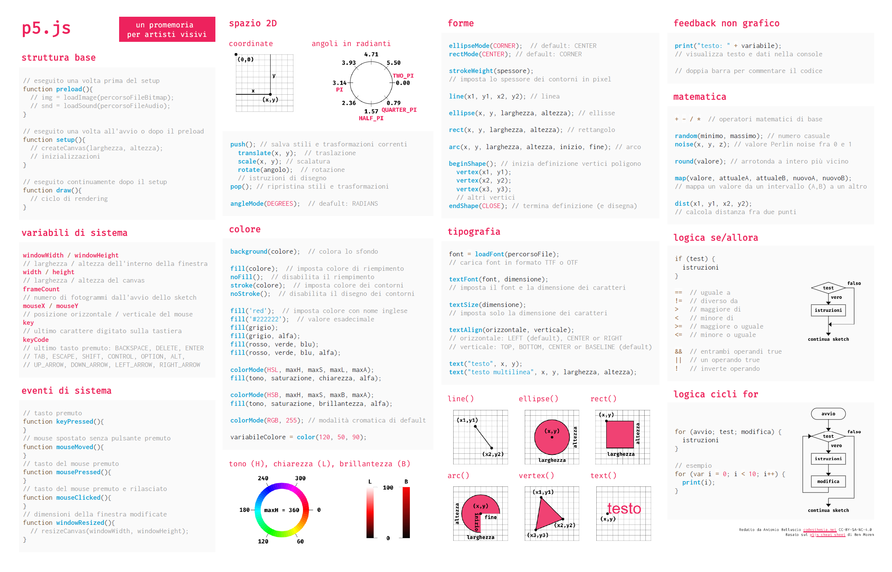

[English](README.md) | Italiano

# Un "bigino" su p5.js per artisti visivi

Questo è un foglio riassuntivo con le nozioni di base su [p5.js](http://p5js.org), pensato per artisti visivi o graphic designer che si stanno avvicinando al creative coding e faticano ancora a ricordarsi la sintassi delle principali istruzioni. Può quindi essere usato in classe, nei workshop o per i primi progetti personali.

- [Vai alla pagina](https://livinbits.github.io/p5js-cheatsheet-forartists/it.html)

Il "bigino" è basato sul [p5js cheat sheet for beginners!](https://github.com/bmoren/p5js-cheat-sheet) di Ben Moren e, al momento, è ottimizzato per la stampa su un unico foglio in formato A4.

#### Da fare:
- migliorare l'impaginazione per i monitor;
- sistemare e ottimizzare l'impaginazione per i dispositivi mobile;
- aggiungere un menu che migliori la consultazione su smartphone in alternativa (ecologica?) alla consultazione su carta.

---
[Creative Commons BY NC SA 4.0](https://creativecommons.org/licenses/by-nc-sa/4.0/)
