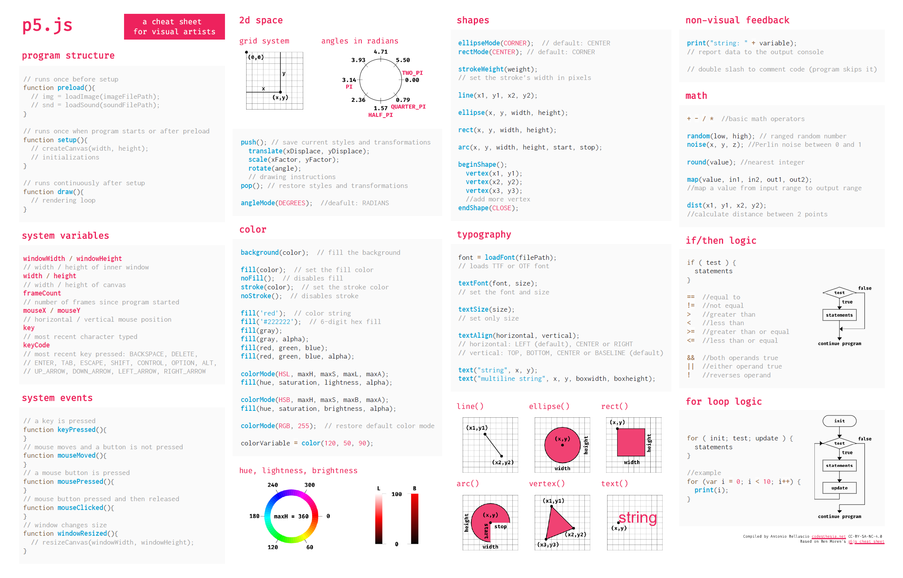

English | [Italiano](README-IT.md)

# A p5js cheat sheet for visual artists

This is a [p5.js](http://p5js.org) cheat sheet conceived for visual artists or graphic designers who are approaching creative coding and still struggle to remember the syntax of the main instructions. It can, therefore, be used in class, workshops, or for your first personal projects.

- [Go to the page](https://livinbits.github.io/p5js-cheatsheet-forartists/)

The cheat sheet is based on Ben Moren's "[p5js cheat sheet for beginners!](https://github.com/bmoren/p5js-cheat-sheet)" and is currently optimized for printing on a single A4 sheet.

#### To do:
- improve the layout for the monitor;
- adjust and optimize the layout for mobile devices;
- add a menu that improves consultation on smartphones as an (eco-friendly?) alternative to consulting the sheet of paper.

---

[Creative Commons BY NC SA 4.0](https://creativecommons.org/licenses/by-nc-sa/4.0/)
